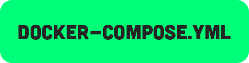

### GENERAL

Your large-scale single-vendor e-commerce backend, powered by Spring Boot, boasts a comprehensive suite of microservices meticulously designed for peak performance. The Discovery Server orchestrates service registration, while the API Gateway serves as a unified entry point. The Auth Service ensures secure access through JWT tokens. The Product, Inventory, Cart, Order, and Payment Services seamlessly manage product data, stock, shopping carts, orders, and payments. Real-time communication thrives on Kafka, employing the Saga Choreography pattern for robust event-driven interactions. Resilience4j stands guard as the circuit breaker, fortifying the system's stability. Together, these components deliver a resilient, efficient, and secure e-commerce ecosystem for your business.

### DESCRIPTION

```json
{
  "Framework"                  : "Spring Boot",
  "Also Used"                  : "Spring Security, JPA, AOP",
  "Token Type"                 : "JWT (JSON Web Token)",
  "Database"                   : "MySQL",
  "Realtime Communication"     : "Kafka"
}
```

### INSTALLATION

 - Project Images

```shell
docker pull saadahmedscse/vendor-voyage-discovery-server
docker pull saadahmedscse/vendor-voyage-api-gateway
docker pull saadahmedscse/vendor-voyage-auth-service
docker pull saadahmedscse/vendor-voyage-product-service
docker pull saadahmedscse/vendor-voyage-order-service
docker pull saadahmedscse/vendor-voyage-cart-service
docker pull saadahmedscse/vendor-voyage-inventory-service
docker pull saadahmedscse/vendor-voyage-payment-service
```

- External Images
```shell
docker pull wurstmeister/kafka
docker pull wurstmeister/zookeeper
docker pull mysql
```

### RUN PROJECT

```yaml
version: '3'

## SERVICES

services:
  discovery-server:
    image: saadahmedscse/vendor-voyage-discovery-server:latest
    ports:
      - "8761:8761"
    networks:
      - v9pre

  api-gateway:
    image: saadahmedscse/vendor-voyage-api-gateway:latest
    ports:
      - "8080:8080"
    depends_on:
      - discovery-server
      - auth-service
      - cart-service
      - inventory-service
```

<a href="https://github.com/saadahmedscse/VendorVoyage-SpringBoot-ECommerce-Microservices/blob/master/docker-compose.yml"></a>

```shell
# GET THE docker-compose.yml BY CLICKING ON THIS BUTTON ABOVE TO RUN THE WHOLE PROJECT
# LOCATE THE docker-compose.yml DIRECTORY AND EXECUTE THIS COMMAND
docker-compose up -d
```

### USAGE

- Auth Service

```bash
# Create Account
curl --location --request POST 'http://localhost:8080/api/auth/create' \
--header 'Content-Type: application/json' \
--data-raw '{
    "name" : "Saad Ahmed",
    "email" : "saadahmedscse@gmail.com",
    "password" : "123456",
    "confirmPassword" : "123456"
}'


# Login
curl --location --request POST 'http://localhost:8080/api/auth/login' \
--header 'Content-Type: application/json' \
--data-raw '{
    "email" : "saadahmedscse@gmail.com",
    "password" : "123456"
}'


# Logout
curl --location --request GET 'http://localhost:8080/api/auth/logout' \
--header 'Authorization: Bearer token'
```

- Product Service

```bash
# Create Product
curl --location --request POST 'http://localhost:8080/api/product' \
--form 'images=@"/D:/Projects/audiore.png"' \
--form 'title="Firebase Cloud Messaging"' \
--form 'description="A greate push notification app for developers"' \
--form 'price="9999"' \
--form 'discount="12"' \
--form 'stock="5"'


# Get Product List
curl --location --request GET 'http://localhost:8080/api/product'


# Get Product
curl --location --request GET 'http://localhost:8080/api/product/{productId}'


# Update Product
curl --location --request POST 'http://localhost:8080/api/product/{productId}' \
--form 'price="15632.0"' 


# Delete Product
curl --location --request DELETE 'http://localhost:8080/api/product/{productId}'
```

- Cart Service

```bash
# Add to Cart
curl --location --request POST 'http://localhost:8080/api/cart/add' \
--header 'Content-Type: application/json' \
--header 'Authorization: Bearer Token' \
--data '{
    "productId" : 1,
    "itemCount" : 3
}'


# Get Cart Items
curl --location --request GET 'http://localhost:8080/api/cart' \
--header 'Authorization: Bearer Token'


# Remove Cart Item
curl --location --request DELETE 'http://localhost:8080/api/cart/remove/{productId}' \
--header 'Authorization: Bearer Token'


# Delete Cart
curl --location --request DELETE 'http://localhost:8080/api/cart/remove' \
--header 'Authorization: Bearer Token'


# Increase Cart Item
curl --location --request GET 'http://localhost:8080/api/cart/increase/{productId}' \
--header 'Authorization: Bearer Token'


# Decrease Cart Item
curl --location --request GET 'http://localhost:8080/api/cart/decrease/{productId}' \
--header 'Authorization: Bearer Token'
```

- Order Service

```bash
# Create Order
curl --location --request POST 'http://localhost:8080/api/order' \
--header 'Content-Type: application/json' \
--header 'Authorization: Bearer Token' \
--data-raw '{
    "name" : "Saad Ahmed",
    "email" : "saadahmedscse@gmail.com",
    "phone" : "01794784643",
    "address" : "Agargaon, Dhaka, Bangladesh",
    "payType" : "BKASH"
}'
# PayType: CARD, BKASH, ROCKET, NAGAD


# Get Order List
curl --location --request GET 'http://localhost:8080/api/order' \
--header 'Authorization: Bearer Token'


# Get Order
curl --location --request GET 'http://localhost:8080/api/order/{orderId}' \
--header 'Authorization: Bearer Token'


# Delete Order (Not recommended)
curl --location --request DELETE 'http://localhost:8080/api/order/{orderId}' \
--header 'Authorization: Bearer Token'
```

### COMPLETED?

```shell
# RUN THIS COMMAND TO STOP ALL SERVICES
docker-compose down
```

### LICENSE
```
Copyright 2018-2023 Saad Ahmed

Licensed under the Apache License, Version 2.0 (the "License");
you may not use this file except in compliance with the License.
You may obtain a copy of the License at

    https://www.apache.org/licenses/LICENSE-2.0

Unless required by applicable law or agreed to in writing, software
distributed under the License is distributed on an "AS IS" BASIS,
WITHOUT WARRANTIES OR CONDITIONS OF ANY KIND, either express or implied.
See the License for the specific language governing permissions and
limitations under the License.
```